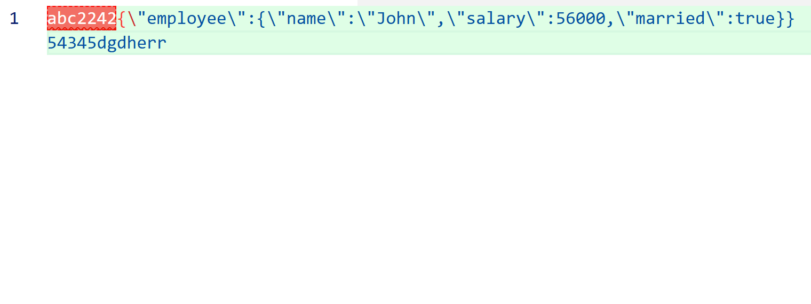
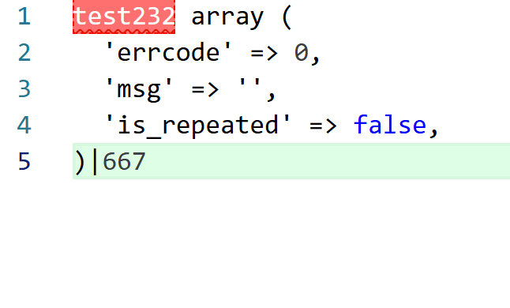

# json-format

在编辑器中解析并格式化 JSON/类 JSON 文本。[vscode插件地址](https://marketplace.visualstudio.com/items?itemName=saltcoreyan.json-format-sortcore)

示例：
- 格式化json字符串，可以识别“{”与“}”之间的内容

- 将php打印出的数组字符串，格式化为json字符串，可以识别“array(”与“)”之间的内容

功能：
- 灵活解析：原始 JSON、被转义包裹的 JSON、多层转义。
- Unicode 还原：支持 \uXXXX 与代理对。
- 可容错（可选）：支持注释与尾逗号（JSONC）。
- 小输入走主线程快速路径，大输入用 worker 分流。
- 遵循编辑器缩进与换行。
- 输入大小限制，避免阻塞（可配置）。

命令：
- json-format: 格式化 JSON（默认快捷键：Ctrl+Alt+J）

设置：
- json-format.maxInputSizeMB（number，默认 2）：最大解析输入大小（MB）。0 表示不限制。
- json-format.decodeUnicode（boolean，默认 true）：是否还原 Unicode 转义。

使用方式：
- 选中文本或直接对整文件运行命令，扩展会解析、还原并格式化输出。